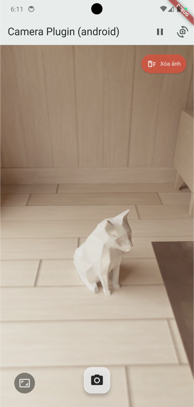
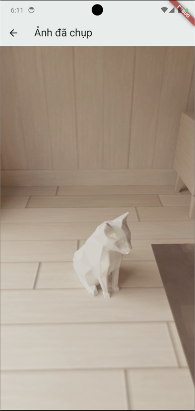

# 📷 Native Camera View - Flutter Plugin

[](https://pub.dev/packages/native_camera_view)
[](/LICENSE)
[](https://pub.dev/packages/native_camera_view)

A Flutter plugin to display a native camera preview for Android and iOS, along with comprehensive camera controls.
The plugin uses `AndroidView` (Android) and `UiKitView` (iOS) to embed the native camera view directly into the Flutter widget tree for high performance.

---

## ✨ Features

* **High-Performance Native Preview**: Directly embeds the device's camera feed for a smooth, lag-free live preview.
* **Android & iOS Support**: Tailored implementations for both Android (using CameraX) and iOS (using AVFoundation).
* **Full Resolution & Quality Control**:
    * **Preview Preset (`previewPreset`):** Set a target resolution for the live preview (`low`, `medium`, `high`, `max`).
    * **Capture Preset (`capturePreset`):** Set a target resolution for the final photo (`low`, `medium`, `high`, `max`).
    * **Capture Mode (`captureMode`):** Optimize for speed (`minimizeLatency`) or quality (`maximizeQuality`). `maximizeQuality` enables advanced post-processing like HDR and noise reduction.
* **Still Image Capture**: Saves the image to the app's cache folder and returns the file path.
* **Advanced Pause/Resume**:
    * **iOS**: Pausing freezes the preview on its last visible frame. This exact frame can be captured even while "paused". The underlying camera session is suspended to save battery.
    * **Android**: Pausing unbinds the Preview use case (stops the feed) while keeping the ImageCapture use case active.
* **Front/Back Camera Switching**: Easily toggle between front and back cameras.
* **Flexible Preview Scaling & Fit Modes**: `cover`, `contain`, `fitWidth`, `fitHeight`.
    * **`cover`**: Scales the preview to completely fill the view. If aspect ratios differ, the video is cropped to fit.
        * ✨ **WYSIWYG Capture**: Photos taken in `cover` mode are automatically cropped to **precisely match what the user saw**, ensuring a "What You See Is What You Get" experience on both platforms.
    * **`contain`**: Scales the preview to fit entirely within the view, maintaining its aspect ratio. This may result in "letterboxing" (empty bars).
    * `fitWidth` / `fitHeight`: Additional scaling options to fit by width or height.
* **Focus Management**:
    * Supports continuous auto-focus on both platforms.
    * **Android (beta)**: Includes tap-to-focus interaction.
* **Clear Cached Images (Beta)**: Provides a utility to delete all photos captured by this plugin from the cache directory.



## 🚀 Installation

### iOS

Add the following keys to your `ios/Runner/Info.plist` file:

```xml
<key>NSCameraUsageDescription</key>
<string>This app needs camera access to preview and capture photos.</string>
<key>NSPhotoLibraryUsageDescription</key>
<string>This app needs access to the photo library to save your photos.</string>
<key>NSPhotoLibraryAddUsageDescription</key>
<string>This app needs permission to add photos to your library.</string>
```

### Android

* **Minimum API Level:** 21 (Android 5.0 - due to CameraX usage)

Add the following permission to your `android/app/src/main/AndroidManifest.xml`:

```xml
<uses-permission android:name="android.permission.CAMERA" />
<uses-feature android:name="android.hardware.camera" android:required="true" />
```


## 🛠️ How to Use

### 1. Add Dependency

```yaml
dependencies:
  flutter:
    sdk: flutter
  native_camera_view: ^0.0.15 # Replace with the latest version
```

Run:

```bash
flutter pub get
```

### 2. Import Plugin

```dart
import 'package:native_camera_view/native_camera_view.dart';
```

### 3. Use `NativeCameraView`

Here is a full example of using the `NativeCameraView` in a `StatefulWidget`

```dart
import 'package.flutter/material.dart';
import 'package.native_camera_view/native_camera_view.dart';

class CameraScreen extends StatefulWidget {
  const CameraScreen({super.key});

  @override
  State<CameraScreen> createState() => _CameraScreenState();
}

class _CameraScreenState extends State<CameraScreen> {
  CameraController? _cameraController;
  bool _isFrontCamera = false;

  void _onCameraControllerCreated(CameraController controller) {
    setState(() {
      _cameraController = controller;
    });
    print("Example App: CameraController created!");
  }

  Future<void> _captureImage() async {
    if (_cameraController == null) return;
    try {
      final path = await _cameraController?.captureImage();
      print("Image captured at: $path");
      // Show the image, e.g., in a new screen
    } catch (e) {
      print("Failed to capture image: $e");
    }
  }

  @override
  Widget build(BuildContext context) {
    return Scaffold(
      appBar: AppBar(title: const Text("Camera Example")),
      body: Stack(
        children: [
          NativeCameraView(
            onControllerCreated: _onCameraControllerCreated,
            cameraPreviewFit: CameraPreviewFit.cover,
            isFrontCamera: _isFrontCamera,
            // --- Quality Settings ---
            previewPreset: CameraResolutionPreset.high,
            capturePreset: CameraResolutionPreset.max,
            captureMode: CameraCaptureMode.maximizeQuality,
            // --- Optional ---
            loadingWidget: const Center(child: CircularProgressIndicator()),
          ),
          Positioned(
            bottom: 30,
            left: 0,
            right: 0,
            child: FloatingActionButton(
              onPressed: _cameraController == null ? null : _captureImage,
              child: const Icon(Icons.camera_alt),
            ),
          ),
        ],
      ),
    );
  }
}
```

### ⚙️ Enums & Parameters

**Enums**

These enums control the quality and behavior of the camera.

* CameraResolutionPreset:

  * `low` (e.g., 640x480)
  * `medium` (e.g., 1280x720)
  * `high` (e.g., 1920x1080)
  * `max` (Uses the highest available resolution)

* CameraCaptureMode:

  * `minimizeLatency`: Prioritizes capture speed. Disables most post-processing.

  * `maximizeQuality`: Prioritizes photo quality. Enables post-processing like HDR and noise reduction.

* CameraPreviewFit:

  * `cover`, `contain`, `fitWidth`, `fitHeight`

---
## 📦 `NativeCameraView` Parameters

| Parameter               | Type                           | Description                                                                                     |
|-------------------------|--------------------------------|-------------------------------------------------------------------------------------------------|
| `onControllerCreated`   | `Function(CameraController)`   | **Required**. Callback that returns the `CameraController` once the native view is initialized. |
| `cameraPreviewFit`      | `CameraPreviewFit?`            | How the preview should be scaled. **Default**: `cover`.                                         |
| `isFrontCamera`         | `bool?`                        | Whether to initially open the front camera. **Default**: `false`.                               |
| `previewPreset`         | `CameraResolutionPreset?`      | Target resolution for the preview stream. **Default**: `null` (system default).                 |
| `captureMode`           | `CameraCaptureMode?`           | Optimization mode for capturing photos. **Default**: `minimizeLatency`.                         |
| `loadingWidget`         | `Widget?`                      | A custom widget to display while the camera is initializing.                                    |
| `bypassPermissionCheck` | `bool?`                        | (Advanced) Bypasses the default permission request logic. Default: false.                       |

---

## 📦 `CameraController` API

```dart
// Capture a new photo. Returns the file path.
final String? path = await _cameraController?.captureImage();

// Pause the camera preview.
await _cameraController?.pauseCamera();

// Resume the camera preview.
await _cameraController?.resumeCamera();

// Switch between front (true) and back (false) cameras.
await _cameraController?.switchCamera(bool useFrontCamera);

// Delete all photos previously captured by this plugin.
await _cameraController?.deleteAllCapturedPhotos();
```
---

## 🐞 Bug Reports & Contributions

Please report issues or contribute at:

🔗 [https://github.com/nat0108/Native-camera-view](https://github.com/nat0108/Native-camera-view)

✉️ nat.anhthai@gmail.com
